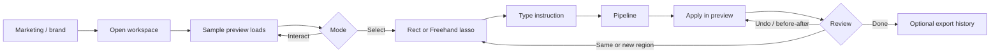

# Monet — Product Requirements Document (PRD)

| Field | Value |
|---|---|
| **Product** | Monet |
| **Name** | After Claude Monet (impressionism) — and a nod to Claude the AI model |
| **Track** | Design (UI/UX, accessibility, product thinking, visual experience) |
| **Document status** | v2.2 — Solo builder · agentic edit pipeline |
| **Last updated** | 2026-08-11 |
| **Owner** | Solo builder |
| **Future reference** | [FUTURE.md](./FUTURE.md) |

---

## 0. Solo builder constraints

This product is designed, built, and demoed by **one person**. That changes priorities, not ambition.

| Rule | Implication |
|---|---|
| Depth over surface area | Polish lasso → instruct → pipeline apply. Cut secondary chrome. |
| Demo reliability over platform | Sample page + stub pipeline beat URL scraping + flaky live models |
| Future ≠ now | Auth and multiplayer are specified for later; see [FUTURE.md](./FUTURE.md) |
| Dogfood the primary persona | Build the tool you would use alone on a page under time pressure |
| No coordination overhead | One stack, opinionated defaults, no “team decision” forks in docs |

**P0 only ships if a solo builder can finish M0–M3 with energy left for craft.** P1 is optional. P2 is post-hackathon only.

---

## 1. Overview

### 1.1 One-liner

**Monet** lets anyone select any region of a live page — like a Photoshop lasso — tell an **agentic pipeline** what should change about *that* area, and watch specialized agents collaborate to apply the improvement in place.

### 1.2 Problem

Improving UI today is either:

- **Global and vague** (“make it pop”, “tighten spacing”) with no spatial anchor for the change, or
- **Tool-locked** (Figma edits) that never touch the *implemented* page, or
- **Screenshot → chatbot** workflows that lose layout context, interaction state, and DOM truth — then leave you to apply the fix yourself, or
- **One-shot “evaluate this” agents** that mix analysis, taste, and implementation into a single opaque pass — often producing commentary instead of a trustworthy scoped edit.

Builders cannot point at a *region of the real product* and say: “Make *this* clearer,” “Fix contrast on *this*,” or “Simplify *this* CTA,” and have a **role-separated agent team** do the work on the live preview.

### 1.3 Solution

A web app where users:

1. Open a page preview (controlled canvas or URL/HTML).
2. Draw a freehand or rectangular **lasso** over the area to change.
3. Write feedback / instructions scoped to that selection.
4. An **agentic pipeline** runs specialized roles in sequence (Scout → Brief → Craft → Brush → Proof) and **applies** the result to the selected region.
5. Review the result; undo or refine with another instruction on the same or a new selection.
6. *(Future — solo roadmap)* Sign in, save edit sessions to the cloud, then invite collaborators ([FUTURE.md](./FUTURE.md)).

### 1.4 Product model (what Monet is / is not)

| Monet **is** | Monet **is not** |
|---|---|
| User-directed editing via a **multi-agent pipeline**, anchored to a selection | A single “evaluate the UI” agent that dumps critique notes |
| Specialized roles (see region, interpret ask, design change, patch, verify) | One monolithic prompt that mixes analysis and implementation |
| The user’s words drive the change | A review lens that “analyzes” and tells the user what’s wrong |
| Apply-in-preview as the primary outcome | Chat about a screenshot with manual follow-through |

The selection is **context for the user’s instruction**. The pipeline’s job is to **execute** that instruction on the region — not to invent a pile of review notes. Roles exist so each stage does one job well; the user still experiences one instruct → apply loop.

### 1.5 Why this wins a design track

| Criterion | How Monet demonstrates it |
|---|---|
| Exceptional UI/UX | The lasso + instruct gesture *is* the product — spatial intent → pipeline → change |
| Accessibility | Users can ask for a11y fixes; Proof verifies measurable remedies before apply |
| Product thinking | Selection scopes intent; role-separated agents close the loop without a review app |
| Visual experience | Precision-tool aesthetic, marching ants, pipeline stage motion, apply morph, before/after |

### 1.6 Non-goals (MVP)

- Full website builder / page CMS
- Pixel-perfect Figma parity or design-token sync
- Automated production deploy pipelines
- Multiplayer presence or auth (planned; see §8)
- Arbitrary public-URL scraping as the primary path (CORS/reliability risk)
- Auto-generated critique / pin feeds as the primary UX (user feedback is the input)
- Exposing every agent’s raw chain-of-thought as the primary UI (optional compact stage progress only)

---

## 2. Goals & success metrics

### 2.1 Product goals

1. Make region selection feel as natural as drawing a selection in Photoshop.
2. Make instruction feel *situated* — Scout grounds geometry + DOM under the lasso before later stages run.
3. Make the pipeline’s primary job **apply the user’s requested change**, not narrate problems — with roles that separate understanding, design, implementation, and verification.
4. Close the loop with reliable apply + undo in the demo (stub pipeline acceptable).
5. Leave clean hooks for future auth + multiplayer (solo post-hackathon) without rewriting selection/pipeline apply.

### 2.2 Hackathon success metrics (demo)

| Metric | Target |
|---|---|
| Time to first lasso → first applied change | < 20 seconds from loaded preview |
| Demo path completion (2–3 instructs + 1 undo) | Reliable in a live 3-minute pitch |
| Perceived “wow” of selection → edit UX | Judges spontaneously react to lasso → live change |
| Instruction fidelity | Visible change matches the user’s ask on the selected region |

### 2.3 Post-hackathon product metrics (future)

| Metric | Definition |
|---|---|
| Activation | % of signed-in users who complete ≥1 apply in first session |
| Depth | Avg successful applies per session |
| Collaboration | % of projects with ≥2 active members |
| Undo / refine rate | % of applies followed by undo or a follow-up instruct |
| Retention (W1) | Users who return and apply again within 7 days |

---

## 3. Personas & jobs-to-be-done

### 3.1 Primary personas (MVP)

| Persona | Job | Need |
|---|---|---|
| **Solo / indie builder** (primary, dogfood) | Shipping a page alone under time pressure | Circle a weak region → say what to fix → see the pipeline change it |
| **Design-minded engineer** | Iterating UI that “feels right” | Region-scoped instructions → verified DOM/CSS updates |
| **Hackathon judge / reviewer** | Evaluating craft quickly | Spatially directed multi-agent edits they can trust in a live demo |

### 3.2 Secondary personas (future product users)

These are **end users of Monet after launch**, not co-builders of the hackathon project.

| Persona | Job | Need |
|---|---|---|
| **Product designer** | Tuning staging | “Make this denser / calmer” without hand-editing CSS |
| **Design lead** | Guiding polish | Shared sessions where instructions and applies sync |
| **A11y specialist** | Fixing flows | “Bump contrast and focus rings in this form” applied on the region |
| **Client / stakeholder** | Giving soft direction | “This area feels cold” → agent interprets and edits |

### 3.3 JTBD

> When I notice something off on a page, I want to **circle that exact area**, **tell a specialized agent team what to change**, and **see the fix applied there**, so I can **improve the right thing without rewriting the whole page**.

---

## 4. Product principles

1. **Selection is the interface.** If the lasso feels bad, the product fails — even if the pipeline is smart.
2. **User feedback is the input.** The human directs; the pipeline executes on the selection.
3. **One job per agent.** Scout, Brief, Craft, Brush, and Proof each own a distinct responsibility — no monolithic “evaluate everything” pass.
4. **Apply over annotate.** Success is a changed preview, not a wall of AI commentary.
5. **Region context before guessing.** Scout extracts colors, type, contrast, targets, DOM so later stages edit the right thing.
6. **Verify before commit.** Proof gates apply on scope/safety (and measurable a11y when asked).
7. **One composition.** The first viewport is a craft tool, not a SaaS dashboard or agent ops console.
8. **Future-ready identity & rooms.** MVP is local/anonymous for a solo demo; models assume users/sessions later ([FUTURE.md](./FUTURE.md)).
9. **Solo-shippable scope.** If a feature needs a second human to build or operate for the pitch, it waits.

---

## 5. User journeys

### 5.1 App flow glimpse (MVP)

Primary loop: land → open workspace → lasso → instruct → pipeline apply → review → refine.



```
Landing ──▶ Workspace ──▶ Preview
                              │
                     Select mode on
                              │
                              ▼
                    Draw lasso (rect / freehand)
                              │
                              ▼
                    Instruct (“make this clearer”)
                              │
                              ▼
              Scout → Brief → Craft → Brush → Proof
                              │
                              ▼
                    Apply on selected region
                              │
                    ┌─────────┴─────────┐
                    ▼                   ▼
                  Undo            Re-instruct / re-lasso
```

Pitch spine (same flow, three regions): **CTA contrast** → **nav hierarchy** → **form focus** — then one undo.

### 5.2 MVP — Solo edit (happy path)

1. Land on Monet marketing/app shell (brand-forward).
2. Enter workspace → sample page loads in preview.
3. Choose tool: **Rect** or **Freehand**.
4. Draw a lasso over a CTA region.
5. Type instruction, e.g. “Increase contrast and make the label clearer.”
6. Pipeline runs: Scout (region) → Brief (intent) → Craft (plan) → Brush (patch) → Proof (verify) → apply in preview.
7. Optional compact stage progress shows roles advancing (not a critique feed).
8. User reviews; optionally **Undo** or **Before/after**.
9. User lassos nav → “Reduce competition; one primary action.” → pipeline applies.
10. User lassos form → “Add visible focus and clearer error affordances.” → pipeline applies.
11. Optional: export edit history summary (JSON/Markdown) for pitch leave-behind.

### 5.3 Future — Authenticated multiplayer edit

> Solo build order: cloud save for one account **before** invites/presence. Details in [FUTURE.md](./FUTURE.md) phases F0–F3.

1. User signs up (email/password or OAuth).
2. Claims or creates an **Edit Session** that syncs across devices (F0).
3. Shares a link for async collaboration (F1), then live selection/apply sync (F2).
4. Collaborators join with presence cursors + draft lasso ghosts (F3).
5. Instructions and applies attribute to authors; threads optional on an edit turn.
6. Conflict rules: last-write-wins on applied preview state; geometry drafts ephemeral while drawing.

---

## 6. Feature requirements

### 6.1 MVP (P0) — must ship for demo

#### F1 — Preview canvas
- Load a **controlled sample page** (built-in HTML/React preview) as default.
- Optional: paste HTML snippet for custom preview (nice-to-have if time).
- Preview is interactive enough to show hover/focus states when not in select mode.
- Toggle **Select mode** vs **Interact mode**.

#### F2 — Lasso selection
- Tools: rectangular marquee + freehand lasso.
- Visual: marching-ants / ink outline, subtle fill, cursor affordance.
- Keyboard: Esc clears; Enter confirms selection (if confirmation step used).
- Touch: single-finger draw supported on tablet (best-effort).
- Selection yields a bounding box + optional polygon path in preview coordinates, plus resolvable DOM targets in the region.

#### F3 — Region context (Scout)
From the selected region, **Scout** extracts and passes downstream (optionally show lightly in UI):
- Dominant colors (swatches)
- Approximate typography signals (size/weight if available from DOM)
- Contrast check for text-on-background pairs when detectable
- Interactive density (links/buttons in region)
- Bounding box size / position metadata
- Target element identities / snippets under the selection

Scout **grounds the pipeline**; it is not a substitute for user instruction. MVP Scout may be fully deterministic (DOM/CSS sampling) with no LLM.

#### F4 — Instruct pipeline
- After selection, primary control is an **instruction input** addressed to the pipeline.
- Placeholder examples: “Make this CTA the clear primary,” “Improve contrast,” “Loosen spacing.”
- Submit sends: selection geometry + Scout facts + user text → pipeline orchestrator.
- Pipeline may surface a short confirmation of what will change; long critique essays are out of scope.
- Optional quick chips (e.g. Contrast / Hierarchy / Spacing) may prefill instruction text — they do **not** auto-run the pipeline without the user.
- Optional compact **stage rail** (Scout → Brief → Craft → Brush → Proof) for demo clarity; not a pin/comment feed.

#### F5 — Pipeline apply
- **Brush** produces a machine-readable patch; **Proof** verifies; then the patch **applies** to the preview for the selected region.
- At least one reliable apply path for demo (e.g. recolor CTA, increase type scale, add focus ring, adjust spacing).
- Scope mutations to the selection / resolved targets — avoid whole-page rewrites.
- Show brief “what changed” summary after apply (one or two lines), not a pin feed.
- Stub fixtures may short-circuit the whole pipeline for pitch resilience.

#### F6 — Undo / refine
- Undo last apply.
- Before/after toggle for demo.
- User can keep the selection (or re-lasso) and send a follow-up instruction to refine.

#### F7 — Demo content pack
- One intentionally imperfect but beautiful sample landing page with known issues:
  - Low-contrast CTA
  - Crowded nav / competing CTAs
  - Form without clear focus/error affordances
- Scripted demo checklist in-repo (`docs/DEMO.md` — optional companion).

#### F8 — Polish & motion
- Intentional motion: lasso draw, pipeline stage advance, apply transition, undo morph (2–3 signature motions).
- Brand-first shell; not a generic purple dashboard.
- Responsive: desktop-primary, usable on laptop screens for judging.

### 6.2 P1 — ship only if M0–M3 already demoable

Solo default: **skip P1** unless the pitch path is solid. Prefer craft (M3) over more features.

- Edit history list (local): instruction + summary of apply
- Export history as Markdown (nice for leave-behind)
- Keyboard shortcuts legend

Explicitly defer unless surplus time: multi-region batch instruct, A/B apply variants, voice input.

### 6.3 P2 — post-hackathon / future integration

Do **not** start in-hackathon. Execute via [FUTURE.md](./FUTURE.md) phases F0–F5.

#### Auth (future — F0)
- Email + password
- OAuth (Google first; GitHub second)
- Session management, password reset, email verification
- Account settings / delete account
- Claim anonymous `localStorage` session into account

#### Multiplayer (future — F1→F4)
- Share links first (async), then realtime edit sync, then presence
- Projects & membership roles (owner, editor, commenter, viewer)
- Optional discussion on an edit turn; @mentions later
- Activity feed / session summary (after F2)

#### Platform expansion (future — F5, pick one at a time)
- URL preview via proxy/sandbox
- Chrome extension: lasso any live site and instruct the pipeline
- Design-system aware edits (tokens)
- Figma frame import / voice instructions
- Parallel specialist Craft agents (e.g. a11y-focused Craft) — only after the serial pipeline is solid

### 6.4 Agentic pipeline roles

Monet does **not** use one agent that “evaluates” the selection. One user submit runs a fixed **serial pipeline**. Each role has a single job and a typed handoff.

```
User instruction + selection
        │
        ▼
   ┌─────────┐
   │  Scout  │  → RegionFacts + targets
   └────┬────┘
        ▼
   ┌─────────┐
   │  Brief  │  → EditBrief (intent + constraints)
   └────┬────┘
        ▼
   ┌─────────┐
   │  Craft  │  → EditPlan (scoped change)
   └────┬────┘
        ▼
   ┌─────────┐
   │  Brush  │  → SuggestionPayload
   └────┬────┘
        ▼
   ┌─────────┐
   │  Proof  │  → Pass, or revise Brush once
   └────┬────┘
        ▼
     Apply (+ short outcome summary)
```

| Role | Job | Input | Output | MVP note |
|---|---|---|---|---|
| **Scout** | See the region | Geometry + preview DOM | `RegionFacts` + resolved targets | Prefer deterministic DOM/CSS sampling |
| **Brief** | Hear the user | Instruction + Scout output | `EditBrief` (normalized intent, constraints, success criteria) | Stub OK |
| **Craft** | Compose the change | Brief + facts | `EditPlan` (what/why, scoped to targets) | Stub OK; no pin essays |
| **Brush** | Produce the patch | Plan + target IDs | `SuggestionPayload` | Must hit `data-monet-id`s for demo |
| **Proof** | Verify before apply | Plan + payload + facts | Pass, or one revise request to Brush | Rules-first (scope, safety, contrast when asked) |

**Orchestrator rules (product):**

- Stages run in order; later stages may not invent new user intent.
- Proof may send Brush **at most one** revision loop in MVP.
- If Brief is too ambiguous, ask **one** clarifying question **or** apply the safest minimal interpretation — do not open a critique thread.
- Stub mode may return a fixture `EditTurn` for known demo lassos without calling live models.
- User-facing default remains one instruct control; stage rail is optional chrome for the pitch.

---

## 7. Information architecture

```
/                     Marketing / brand hero + CTA “Open workspace”
/app                  Workspace shell
/app/edit             Preview + tools + instruct + apply (MVP primary surface)
/app/edit/:id         Named edit session (future)
/login                Auth (future)
/signup               Auth (future)
/projects             Project list (future)
/projects/:id         Project overview (future)
/settings             Account & preferences (future)
```

MVP may collapse to `/` + `/app` only, with future routes stubbed or reserved.

### 7.1 Workspace layout (MVP)

```
┌────────────────────────────────────────────────────────────┐
│ Brand · Session name · Select/Interact · Share(soon)       │
├──────────────┬─────────────────────────────┬───────────────┤
│ Tools        │                             │ Instruct      │
│ Rect/Lasso   │       Preview canvas        │ (to pipeline) │
│ Clear        │       + selection overlay   │ + Scout facts │
│ Undo apply   │                             │ + stage rail  │
│              │                             │ + Apply/Undo  │
└──────────────┴─────────────────────────────┴───────────────┘
```

Primary right-rail job: **instruct the pipeline about the selection**, not browse AI-generated pins or agent transcripts.

---

## 8. Future: Auth & multiplayer (product requirements)

> **Not MVP blockers.** Full solo integration plan, phase order, and resume checklist: **[FUTURE.md](./FUTURE.md)**.  
> Requirements below stay as the product contract; do not implement during hackathon beyond stubs/ports.  
> FUTURE/TRD are aligned to the agentic edit pipeline (Scout → Brief → Craft → Brush → Proof).

### 8.1 Auth requirements

| ID | Requirement |
|---|---|
| A1 | Users can register with email + password |
| A2 | Users can sign in with OAuth (Google, GitHub) |
| A3 | Users can sign out; sessions expire securely |
| A4 | Password reset via email |
| A5 | Email verification before sensitive actions (optional phase 1) |
| A6 | Anonymous MVP usage can later be **claimed** into an account (edit migration) |
| A7 | Auth UI matches Monet visual language (not stock template chrome) |

### 8.2 Multiplayer / collaboration requirements

| ID | Requirement |
|---|---|
| M1 | An Edit Session belongs to a Project and has a stable ID |
| M2 | Members join via invite email or share link with role |
| M3 | Preview state / edit turns (pipeline results) sync in real time across clients |
| M4 | Presence: avatar/cursor + “selecting” / “instructing” / “pipeline running” state |
| M5 | Instruction and apply authorship and timestamps are visible |
| M6 | Optional replies on an edit turn |
| M7 | Soft-lock or ephemeral selection ownership while drawing |
| M8 | Offline/tab-blur: graceful reconnect; no silent loss of last apply |
| M9 | Viewer role: can see preview + history, cannot instruct/apply |

### 8.3 Roles (future)

| Role | Instruct pipeline | Apply / undo | Edit others’ instructions | Manage members |
|---|---|---|---|---|
| Owner | ✓ | ✓ | ✓ | ✓ |
| Editor | ✓ | ✓ | ✓ | — |
| Commenter | ✓ (suggest only) | — | own only | — |
| Viewer | — | — | — | — |

### 8.4 Privacy & trust (future)

- Project visibility: private by default.
- Share links can be revoked.
- OAuth scopes minimized.
- No training on private page content without explicit opt-in (policy placeholder).

---

## 9. Instruction & apply quality bar

### 9.1 Pipeline turn shape

Every successful **edit turn** should include artifacts from the roles (even if stubbed):

1. **Scout** — region facts + resolved targets  
2. **Brief** — understood intent + constraints / success criteria  
3. **Craft** — scoped change plan (elements / styles inside the selection)  
4. **Brush** — machine-readable apply payload  
5. **Proof** — pass/fail notes (one line is enough)  
6. **Outcome summary** — one or two lines after apply (“CTA contrast 2.9→4.6; label weight +100”)

Long multi-issue critique reports are **not** the product. Role outputs are working artifacts, not a pin feed.

### 9.2 Instruction types the demo should handle

- **Visual / UI** — color, type, hierarchy, spacing  
- **UX** — affordance, competing CTAs, scanning clarity  
- **A11y** — contrast, focus visibility, target size, labels  
- **Implementation-flavored** — “use a clearer primary button style here” with concrete CSS/DOM result  

The user may mix these in natural language; the product does **not** require picking a “lens” or specialist agent first. Brief + Craft interpret the mix; Proof enforces measurable a11y when the brief asks for it.

### 9.3 Guardrails

- Prefer edits confined to the selection / resolved targets (Proof rejects out-of-scope patches).
- Prefer measurable changes when the user asks for a11y (contrast ratio, target size).
- Distinguish taste requests from accessibility requirements in the outcome summary when relevant.
- If the ask is ambiguous, Brief asks one clarifying question **or** Craft applies the safest minimal interpretation — do not dump a review essay.
- Never insult the existing design; just change it per instruction.
- No stage may silently replace the user’s intent with an unsolicited redesign of the whole page.

---

## 10. Accessibility requirements (product)

MVP product UI must itself meet a high bar:

- Full keyboard path for tools (switch tool, clear, confirm, focus instruct input, undo).
- Visible focus styles.
- Instruct input and history available without relying only on canvas hit targets.
- Respect `prefers-reduced-motion` (simplify marching ants / apply motion).
- Color is not the only status signal for apply success/failure (icons + text).
- Target sizes ≥ 44×44 CSS px for primary controls.
- Meaningful names for screen readers on tools and pipeline controls.
- If a stage rail is shown, stages are announced via `aria-live` without requiring pointer access.

When users instruct a11y fixes, Proof should require WCAG 2.2–aligned remedies where relevant (contrast, focus visible, target size, labels, status messages).

---

## 11. Design direction (product)

### 11.1 Metaphor

**Precision edit atelier** — selection, directed change, specialized hands. Closer to a design microscope + brush crew than a single chatbot or comment layer.

### 11.2 Visual rules

- Brand name **Monet** is a hero-level signal on marketing surface.
- Avoid generic AI-SaaS purple gradients and dashboard card grids.
- Atmosphere via subtle grid/film-grain/tooling textures + purposeful type — not flat white void.
- Canvas is the star; side panel is the instruct instrument, not a card stack of AI opinions or agent logs.
- Motion budget: lasso stroke, pipeline stage advance, apply morph, undo — intentional, few.

### 11.3 Tone of voice

- Direct, craft-aware, non-corporate.
- Pipeline confirmations: “Bumped CTA contrast to 4.5:1 and raised label weight” over “I have carefully considered enhancing visual accessibility.”
- Stage labels stay short: Scout / Brief / Craft / Brush / Proof — not “Analyzing your request with our multi-agent system.”

---

## 12. Risks & mitigations

| Risk | Impact | Mitigation |
|---|---|---|
| CORS / arbitrary URL preview fails live | Demo break | Controlled sample page as default |
| Pipeline latency kills pitch | Low energy | Scout facts immediately; stub short-circuit; cache demo fixtures; optional optimistic apply |
| Selection feels janky | Product fails | Prioritize pointer pipeline + visuals over more agent roles |
| Brush edits wrong/out-of-region nodes | Trust break | Scout resolves targets; Proof constrains patch scope |
| Scope creep into full page builder | Missed polish | Hard non-goals; region-scoped apply only |
| Relapse into “AI review + pins” UX | Wrong product | Instruct + apply primary surface; role artifacts stay secondary |
| Pipeline becomes ops console | Design-track miss | Compact stage rail only; hide raw prompts by default |
| Auth/multiplayer started too early | No demo | Ports only; follow [FUTURE.md](./FUTURE.md) after ship |
| Solo scope creep / burnout | Unfinished demo | Kill P1 first; never start F0 during hackathon |

---

## 13. Open questions

1. Final product name locked as **Monet**.
2. AI provider for hackathon — default **stub pipeline fixtures + optional hosted**; live API only if stable before pitch?
3. Freehand polygon fidelity vs bbox-only targeting for v1 — default **bbox + DOM hit-test under path for apply**?
4. How much narration after apply — default **one short summary line** (Proof notes optional)?
5. Show stage rail in MVP demo, or only after apply summary?
6. Post-hackathon: confirm Supabase as solo default ([FUTURE.md](./FUTURE.md) §4–5)?
7. Chrome extension as F5 follow-up or later?

---

## 14. Milestones (solo-timeboxed)

Hackathon = **M0–M3** (+ light **M4** stubs if energy remains). **M5+** is post-hackathon via [FUTURE.md](./FUTURE.md).

| Phase | Scope | Outcome | Solo note |
|---|---|---|---|
| **M0 — Foundation** | App shell, sample page, select mode | Can draw a lasso | Do not leave until stroke feels good |
| **M1 — Instruct** | Scout facts + instruct UI + pipeline/stub response | First situated instruction | Stub pipeline OK for pitch |
| **M2 — Loop** | Brush apply + Proof gate + undo + demo pack | Closed-loop demo | One solid apply path minimum |
| **M3 — Craft** | Motion (incl. stage rail), a11y chrome, brand landing | Design-track ready | Protect this over P1 features |
| **M4 — Future stubs** | `AuthPort` / `RealtimePort` + edit reducer | Clean integration path | <2h; no auth UI |
| **F0–F5 — Platform** | Cloud save → share → realtime → presence → projects | Collaborative product | See [FUTURE.md](./FUTURE.md) |

---

## 15. Appendix — Glossary

| Term | Meaning |
|---|---|
| **Lasso** | Freehand or rect selection gesture over the preview |
| **Region** | Geometric + optional DOM subset under a lasso |
| **Instruction** | User feedback / directive to the pipeline about the selected region |
| **Pipeline** | Ordered agent roles that turn instruction + region into a verified apply |
| **Scout** | Role that extracts region facts and DOM targets |
| **Brief** | Role that normalizes user intent into an `EditBrief` |
| **Craft** | Role that composes a scoped `EditPlan` |
| **Brush** | Role that emits the machine-readable patch |
| **Proof** | Role that verifies scope/safety/a11y before apply |
| **Apply** | Mutating the preview from a Brush patch payload after Proof |
| **Edit turn** | One instruct → pipeline → apply cycle (and its short outcome summary) |
| **Edit Session** | A page preview + its edit history (becomes multiplayer room later) |
| **Project** | Future container for sessions, members, and permissions |
| **F0–F5** | Solo post-hackathon phases in [FUTURE.md](./FUTURE.md) |
